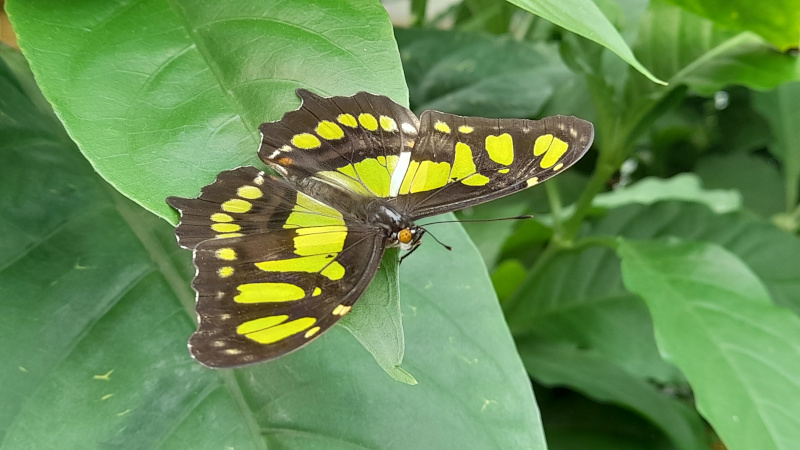

It's straightforward to include images on an Iceforge site.  Any file types in your content directory that Iceforge doesn't recognise as files that should be processed, are passed through to the output unchanged.  If you reference them on a Markdown page, Iceforge will automatically rewrite relative links so they work even if the page's content has been embedded somewhere else on the site---like on the homepage of your blog.

<span class="more">With</span> the blog template, all you need to do is:

- drop the file in the same folder as the Markdown page
- reference it in your Markdown by just its name.  Don't worry about the path.

The syntax for including an image in your Markdown is:

```

```

In other words, the following code...

```

```

...gives you this


